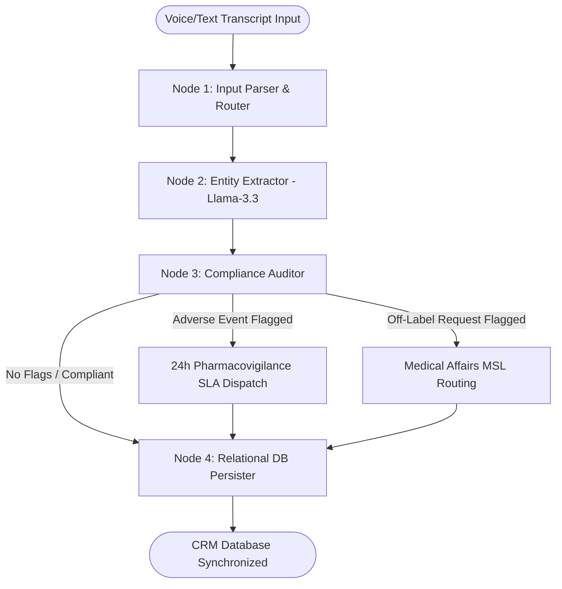

<div align="center">

<br/>

```
  ██████╗ ██╗ ██████╗  █████╗  ██████╗ ███████╗███╗   ██╗████████╗     ██████╗██████╗ ███╗   ███╗
  ██╔══██╗██║██╔═══██╗██╔══██╗██╔════╝ ██╔════╝████╗  ██║╚══██╔══╝    ██╔════╝██╔══██╗████╗ ████║
  ██████╔╝██║██║   ██║███████║██║  ███╗█████╗  ██╔██╗ ██║   ██║       ██║     ██████╔╝██╔████╔██║
  ██╔══██╗██║██║   ██║██╔══██║██║   ██║██╔══╝  ██║╚██╗██║   ██║       ██║     ██╔══██╗██║╚██╔╝██║
  ██████╔╝██║╚██████╔╝██║  ██║╚██████╔╝███████╗██║ ╚████║   ██║       ╚██████╗██║  ██║██║ ╚═╝ ██║
  ╚══════╝ ╚═╝ ╚═════╝ ╚═╝  ╚═╝ ╚═════╝ ╚══════╝╚═╝  ╚═══╝   ╚═╝        ╚═════╝╚═╝  ╚═╝╚═╝     ╚═╝
```

### **FDA-Audited Real-Time PhRMA Compliance & AI-Dictation CRM Portal**

<br/>

[](https://react.dev)
[](https://typescriptlang.org)
[](https://tailwindcss.com)
[](https://redux-toolkit.js.org)
[](https://vitejs.dev)
[](https://groq.com)

<br/>

> **An AI-first Customer Relationship Management (CRM) portal** designed for pharmaceutical sales representatives and healthcare professionals (HCPs). Automatically parses voice dictations, registers samples under Sunshine Act limits, and enforces compliance.

<br/>

[**Features**](#-core-features) · [**Compliance**](#-compliance-safeguards) · [**Architecture**](#-system-architecture--workflow) · [**Codebase Walkthrough**](#-file--codebase-directory-walkthrough) · [**Quick Start**](#-installation--local-setup)

<br/>

---

</div>

## ✨ Core Features
*   **Dual-Pane Workspace**: Combines a real-time, read-only compliance form on the left with an interactive **AI Voice Co-pilot** chat interface on the right.
*   **Natural Language Processing**: Auto-extracts doctors, specialties, discussed topics, distributed samples, adverse events, and next-visit deadlines.
*   **HCP Directory**: Fully searchable clinician registry indicating quarterly target contact progress, prescribing tiers, and contact history.
*   **Technical Explorer**: Interactive live dashboard displaying internal compiled python nodes, FastAPI endpoint definitions, SQL schemas, and Redux client state.

---

## 🛡️ Compliance Safeguards

To align with PhRMA codes and FDA regulations, the portal implements the following safeguards:

| Safeguard | Trigger Criteria | Compliance Action |
| :--- | :--- | :--- |
| **Pharmacovigilance (SLA)** | Mentions of side effects, cramps, discomfort, or toxicity | Triggers a **24-hour Adverse Event (AE) escalation** report, locking details for safety team reviews. |
| **Off-Label Gating (MIR)** | Requests for unapproved combos, dosage variations, or trial results | Generates a **Medical Information Request (MIR)** and routes to a Medical Science Liaison (MSL). |
| **Sunshine Act Transparency** | Allocation of drug samples or co-pay vouchers | Accumulates fair-market dollar values and displays warning indicators when spend thresholds are exceeded. |

---

## ⛓️ System Architecture & Workflow

Under the hood, the app simulates a multi-node LangGraph orchestration pipeline executing on Groq endpoints:



---

## 📂 File & Codebase Directory Walkthrough

Here is a detailed guide on the source files and components:

### 1. Main Entrypoint & Page Shell
*   **[src/App.tsx](file:///c:/Users/swain/OneDrive/Documents/FULL%20STACK%20projects/bioagent-crm/src/App.tsx)**
    *   **Description**: Hosts the primary dashboard statistics (calls logged, spend totals, Pharmacovigilance SLA counters, and quarterly completion meter). 
    *   **Usage**: Controls client routing via tabs (`dashboard`, `logger`, `history`, `technical`) and holds the layout layout container.

### 2. UI Components
*   **[src/components/ConversationalLogger.tsx](file:///c:/Users/swain/OneDrive/Documents/FULL%20STACK%20projects/bioagent-crm/src/components/ConversationalLogger.tsx)**
    *   **Description**: Implements the AI Voice Co-pilot. Features dictation presets (Standard Detail, Adverse Event Flag, and Off-label inquiry) and custom text typing.
    *   **Logic**: Uses a rule-based NLP simulator to parse inputs and updates Redux state. Outputs Markdown blocks indicating parsed status from `llama-3.3-70b-versatile @ Groq`.
*   **[src/components/StructuredForm.tsx](file:///c:/Users/swain/OneDrive/Documents/FULL%20STACK%20projects/bioagent-crm/src/components/StructuredForm.tsx)**
    *   **Description**: Renders the compliance-gated database entry form. 
    *   **Logic**: Serves as a read-only visual overlay until values are generated or updated by the Voice Co-pilot. Form validation is performed (e.g., verifying that Adverse Events have detailed explanations) before committing updates.
*   **[src/components/HcpDirectory.tsx](file:///c:/Users/swain/OneDrive/Documents/FULL%20STACK%20projects/bioagent-crm/src/components/HcpDirectory.tsx)**
    *   **Description**: Lists registered physicians and medical organizations.
    *   **Logic**: Provides text search and dropdown filters (Specialty, Prescribing Tier). Each profile displays email, phone, last contact date, and a progress bar mapping completed quarterly contacts.
*   **[src/components/TechnicalExplorer.tsx](file:///c:/Users/swain/OneDrive/Documents/FULL%20STACK%20projects/bioagent-crm/src/components/TechnicalExplorer.tsx)**
    *   **Description**: The developer gateway.
    *   **Content**: Renders python scripts for compiled LangGraph nodes, FastAPI REST endpoints (`/api/interactions/conversational-log`), relational PostgreSQL schemas (`database/schema.sql`), and a live state viewer rendering `store.getState()`.

---

## 🗃️ Data Models & Types

All data structures are typed and declared in **[src/types/index.ts](file:///c:/Users/swain/OneDrive/Documents/FULL%20STACK%20projects/bioagent-crm/src/types/index.ts)**:

```typescript
// Healthcare Professional profile representation
export interface HCP {
  id: string;
  name: string;
  specialty: string;
  hospital: string;
  email: string;
  phone: string;
  prescribingTier: 'High (Tier 1)' | 'Medium (Tier 2)' | 'Low (Tier 3)';
  lastContacted: string;
  targetFrequency: number;
  completedFrequency: number;
}

// Logged interaction structure mapping to database tables
export interface Interaction {
  id: string;
  hcpId: string;
  hcpName: string;
  date: string;
  channel: 'In-Person' | 'Virtual' | 'Email' | 'Phone';
  duration: number;
  topics: string[];
  notes: string;
  samplesProvided: {
    name: string;
    quantity: number;
    valuePerUnit: number;
  }[];
  adverseEventFlag: boolean;
  adverseEventDetails?: string;
  medicalInquiryFlag: boolean;
  medicalInquiryDetails?: string;
  followUpDate?: string;
  followUpTask?: string;
  logMethod: 'Structured Form' | 'Conversational AI';
  complianceStatus: 'Approved' | 'Flagged for Review' | 'AE Escalated' | 'MIR Routed';
}
```

---

## ⚡ State Management (Redux Store)

Managed in **[src/store/index.ts](file:///c:/Users/swain/OneDrive/Documents/FULL%20STACK%20projects/bioagent-crm/src/store/index.ts)** using Redux Toolkit slices:

*   **`updateDraftField`**: Real-time form updates as inputs change.
*   **`setDraftFromExtracted`**: Maps parsed entities from the Llama/Groq pipeline to corresponding fields in the structured form. Matches parsed physician names with the registry database.
*   **`submitDraft`**: Synchronizes the completed interaction report with the history log, updates prescribing analytics, and resets form states.

---

## 💻 Installation & Local Setup

### Prerequisites
*   [Node.js](https://nodejs.org/) (v18+)
*   NPM or Yarn package manager

### Steps
1.  Clone the repository and navigate to the directory:
    ```bash
    cd bioagent-crm
    ```
2.  Install required dependencies:
    ```bash
    npm install
    ```
3.  Set up environment configurations:
    ```bash
    cp .env.example .env.local
    ```
    *(Open `.env.local` and configure your `LLM_API_KEY` environment variables if integration endpoints are used.)*

4.  Start the local development server:
    ```bash
    npm run dev
    ```

5.  Open your browser and navigate to **[http://localhost:3000](http://localhost:3000)**.

---

## 🤝 Connect & Support

Feel free to connect, ask questions, or collaborate:

*   **LinkedIn**: [](https://www.linkedin.com/in/aditya-ranjan-swain)
*   **GitHub**: [](https://github.com/Aditya1791)

If this project helps you or if you want to support my work, feel free to buy me a coffee! ☕

<div align="center">
  <br/>
  <p><b>Scan QR to Support the Project / Buy Me a Coffee</b></p>
  
</div>

---

## 📄 License

MIT © [Aditya Ranjan Swain](https://github.com/Aditya1791)
